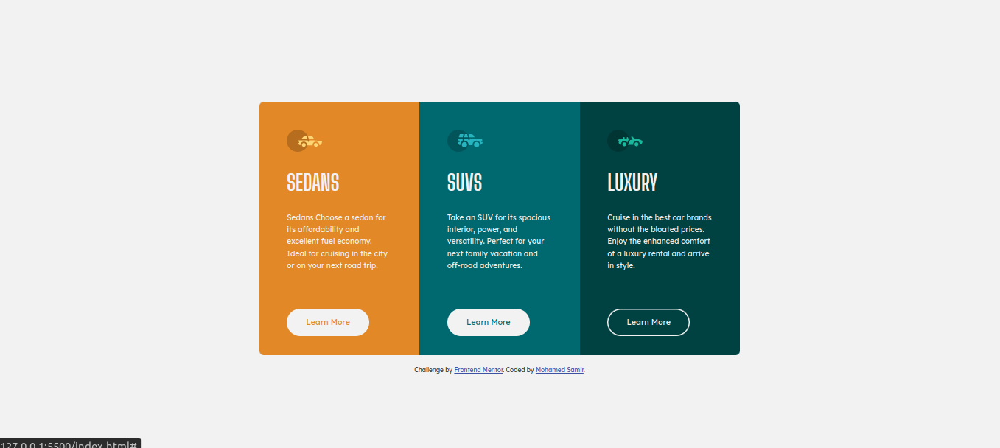
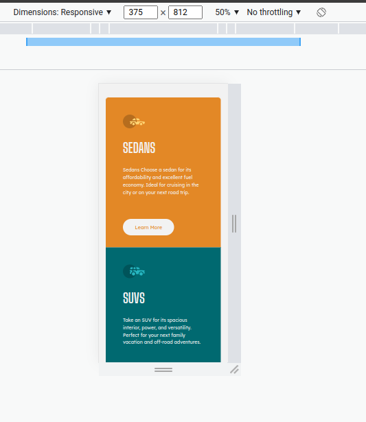

# Frontend Mentor - 3-column preview card component solution

This is a solution to the [3-column preview card component challenge on Frontend Mentor](https://www.frontendmentor.io/challenges/3column-preview-card-component-pH92eAR2-). Frontend Mentor challenges help you improve your coding skills by building realistic projects.

## Table of contents

- [Overview](#overview)
  - [The challenge](#the-challenge)
  - [Screenshot](#screenshot)
  - [Links](#links)
- [My process](#my-process)
  - [Built with](#built-with)
  - [What I learned](#what-i-learned)
  - [Continued development](#continued-development)
- [Author](#author)
- [Acknowledgments](#acknowledgments)

## Overview

### The challenge

Users should be able to:

- View the optimal layout depending on their device's screen size
- See hover states for interactive elements

### Screenshot

**Desktop**

**Mobile**

### Links

- Solution URL: [Add solution URL here](https://your-solution-url.com)
- Live Site URL: [3 column preview card component](https://3-columns-preview-card-component-mohamed.netlify.app/)

## My process

### Built with

- Semantic HTML5 markup
- CSS custom properties
- Flexbox
- CSS Grid
- Desktop-first workflow

### What I learned

there is trick i learned today which is pushing the button link to the very end of the card

if you use flexbox on the container ypu can push the last element to the very end of the container by using this css property (in my case)`margin-top: auto`

### Continued development

i'll continue using css grid alongside with flexbox in the next challenges

## Author

- LinkedIn - [Mohamed Samir](https://www.linkedin.com/in/mohamad-samir08/)
- Frontend Mentor - [@mohamed-sameer](https://www.frontendmentor.io/profile/mohamed-sameer)

## Acknowledgments

Thanks for [frontendmentor](https://www.frontendmentor.io) for providing these challenges.
